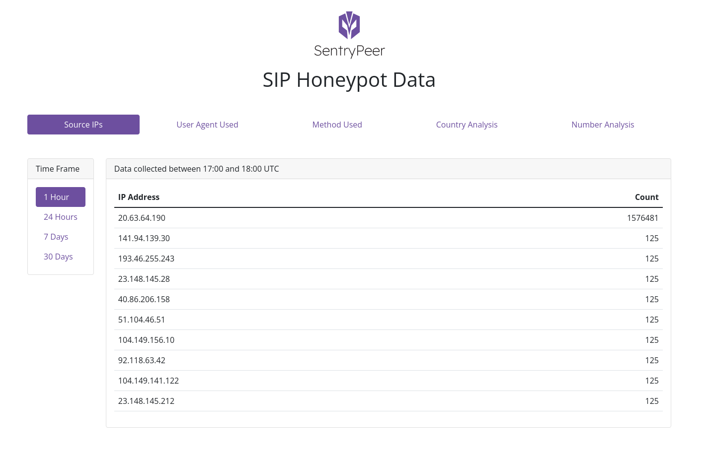

## SentryPeer

 

A distributed list of bad IP addresses and phone numbers collected via a SIP Honeypot.

[](https://scan.coverity.com/projects/sentrypeer-sentrypeer)
[](https://github.com/SentryPeer/SentryPeer/actions/workflows/main.yml)
[](https://github.com/SentryPeer/SentryPeer/actions/workflows/codeql-analysis.yml)
[](https://github.com/SentryPeer/SentryPeer/actions/workflows/clang-analyzer.yml)
[](https://lgtm.com/projects/g/SentryPeer/SentryPeer/context:cpp)
[](https://lgtm.com/projects/g/SentryPeer/SentryPeer/alerts/)
[](https://bestpractices.coreinfrastructure.org/projects/5374)

## Introduction

This is basically a fraud detection tool. It lets bad actors try to make phone calls and saves the IP address they came from and number they tried to call. Those details are then used to block them at the service providers network and the next time a user/customer tries to call a collected number, it's blocked.

Traditionally this data is shipped to a central place, so you don't own the data you've collected. This project is all about Peer to Peer sharing of that data. The user owning the data and various Service Provider / Network Provider related feeds of the data is the key bit for me. I'm sick of all the services out there that keep it and sell it. If you've collected it, you should have the choice to keep it and/or opt in to share it with other SentryPeer community members via p2p methods.

Of course, if you don't want to run any of this and just buy access to the data that users have opted in to share, then that's a choice too. One day, maybe.

The sharing part...you only get other users' data if you [share yours](https://en.wikipedia.org/wiki/Tit_for_tat#Peer-to-peer_file_sharing). That's the key. It could be used (the sharing of data logic/feature) in many projects too if I get it right :-)

## Screenshots

Here's a mockup of the web UI which is subject to change.

[](./screenshots/SentryPeer-Web-GUI-screenshot.png)

Screenshots of agents and APIs to come...

## Goals

- [x] All code [Free/Libre and Open Source Software](https://www.gnu.org/philosophy/floss-and-foss.en.html)
- [x] FAST
- [x] User _owns their_ data
- [ ] User can submit their own data if they want to - _opt out_ (default is to submit data)
- [ ] User gets other users' data ([Tit for tat?](https://en.wikipedia.org/wiki/Tit_for_tat#Peer-to-peer_file_sharing)) **ONLY IF** they opt in to submit their data to the pool ([DHT](https://en.wikipedia.org/wiki/Distributed_hash_table)? - need to do a [PoC](https://en.wikipedia.org/wiki/Proof_of_concept))
- [ ] Peer to Peer sharing of data - [Zyre (Zeromq)](https://github.com/zeromq/zyre)
- [ ] User can **pay to get all data collected** via [SentryPeer commercial website](https://sentrypeer.com) (one day, maybe.)
- [ ] Data is max 7(?) days old as useless otherwise
- [x] **Local** data copy for **fast access** - feature / cli flag
- [ ] **Local** API for **fast access** - feature / cli flag
- [ ] **Local** Web GUI for **fast access** - feature / cli flag
- [ ] Peer to Peer data replication - feature / cli flag
- [x] Local [sqlite](https://www.sqlite.org/index.html)/[lmdb](https://www.symas.com/symas-embedded-database-lmdb) database - feature / cli flag
- [ ] Analytics - opt in
- [ ] SDKs/libs for external access - [CGRateS](https://github.com/cgrates/cgrates) to start with and maybe [Fail2Ban](https://www.fail2ban.org/wiki/index.php/Main_Page) or our own with nftables
- [x] Small binary size for IoT usage
- [x] Cross-platform
- [ ] Firewall options to use distributed data in real time - [DHT](https://en.wikipedia.org/wiki/Distributed_hash_table)?
- [ ] Container on Docker Hub for latest build - Reference https://github.com/natm/iocontrollergw/blob/master/.github/workflows/cd.yaml and https://github.com/natm/iocontrollergw/blob/master/.github/workflows/ci.yaml (plus Nat's Dockerfile :-) )
- [ ] BGP agent to peer with for blackholing collected IP addresses (similar to [Team Cymru Bogon Router Server Project](https://team-cymru.com/community-services/bogon-reference/bogon-reference-bgp/))
- [ ] SIP agent to return 404 or default destination for SIP redirects

## Design

TBD :-)

I started this because I wanted to do [C network programming](https://github.com/codeplea/Hands-On-Network-Programming-with-C) as all the projects I use daily are in C like [PostgreSQL](https://www.postgresql.org/), [OpenLDAP](https://www.openldap.org/), [FreeSWITCH](https://freeswitch.com/), [OpenSIPS](https://opensips.org/),
[Asterisk](https://www.asterisk.org/) etc. See
[Episode 414: Jens Gustedt on Modern C](https://www.se-radio.net/2020/06/episode-414-jens-gustedt-on-modern-c/) for why [C](https://en.wikipedia.org/wiki/C_(programming_language)) is a good choice.  For those interested, see my full podcast show list (https://www.se-radio.net/team/gavin-henry/) for [Software Engineering Radio](https://www.se-radio.net/)

### Installation
 
You have two options for installation. CMake or autotools. Autotools is recommended at the moment. A release is an autotools build.

If you are going to build from this repository, you will need to have the following installed:

* `libosip2-dev` (Debian/Ubuntu) or `libosip2-devel` (Fedora/CentOS)
* `libsqlite3-dev` (Debian/Ubuntu) or `libsqlite3-devel` (Fedora/CentOS)
* `libcmocka-dev` (Debian/Ubuntu) or `libcmocka-devel` (Fedora/CentOS) - for unit tests

Debian/Ubuntu:

    sudo apt-get install libosip2-dev libsqlite3-dev libcmocka-dev

CentOS/Fedora:

    sudo yum install libosip2-devel libsqlite3-devel libcmocka-devel

then (make check is highly recommended):


    ./bootstrap.sh
    ./configure
    make
    make check
    make install


Once built, you can run like so to start in debug mode (this won't work as a daemon yet):

    ./sentrypeer -d
    Starting sentrypeer...
    Configuring local address...
    Creating socket...
    Binding socket to local address...
    Setting database error log callback...
    Listening for incoming connections...

when you get a probe request, you can see something like the following in the terminal:

```bash
Received (411 bytes): OPTIONS sip:100@XXX.XXX.XXX.XXX SIP/2.0
Via: SIP/2.0/UDP 91.223.3.152:5173;branch=z9hG4bK-515761064;rport
Content-Length: 0
From: "sipvicious"<sip:100@1.1.1.1>;tag=6434396633623535313363340131363131333837383137
Accept: application/sdp
User-Agent: friendly-scanner
To: "sipvicious"<sip:100@1.1.1.1>
Contact: sip:100@91.223.3.152:5173
CSeq: 1 OPTIONS
Call-ID: 679894155883566215079442
Max-Forwards: 70


read_packet_buf size is: 1024: 
read_packet_buf length is: 468: 
bytes_received size is: 411: 

Bad Actor is:
Event Timestamp: 2021-11-23 20:13:36.427515810
SIP Message: OPTIONS sip:100@XXX.XXX.XXX.XXX SIP/2.0
Via: SIP/2.0/UDP 91.223.3.152:5173;branch=z9hG4bK-515761064;rport
From: "sipvicious" <sip:100@1.1.1.1>;tag=6434396633623535313363340131363131333837383137
To: "sipvicious" <sip:100@1.1.1.1>
Call-ID: 679894155883566215079442
CSeq: 1 OPTIONS
Contact: <sip:100@91.223.3.152:5173>
Accept: application/sdp
User-agent: friendly-scanner
Max-forwards: 70
Content-Length: 0


Source IP: 193.107.216.27
Called Number: 100
SIP Method: OPTIONS
Transport Type: UDP
User Agent: friendly-scanner
```

You can see the data in the sqlite3 database called `sentrypeer.db` using [sqlitebrowser](https://sqlitebrowser.org/) or sqlite3 command line tool.

Here's a screenshot of the database opened using [sqlitebrowser](https://sqlitebrowser.org/) (it's big, so I'll just link to the image):

[sqlitebrowser exploring the sentrypeer.db](./screenshots/SentryPeer-sqlitebrowser.png)

The REST API and web UI are coming soon. Please click the Watch button to be notified when they are ready and hit Like to follow the development :-)

### License
 
Great reading - [How to choose a license for your own work](https://www.gnu.org/licenses/license-recommendations.en.html)

This work is dual-licensed under GPL 2.0 and GPL 3.0.

`SPDX-License-Identifier: GPL-2.0-only OR GPL-3.0-only`

### Contributing

See [CONTRIBUTING](./CONTRIBUTING.md)

### Project Website

https://sentrypeer.org
 
### Commercial Services (one day, maybe)
 
https://sentrypeer.com

### Trademark

[**SENTRYPEER** is a pending registered trademark](https://trademarks.ipo.gov.uk/ipo-tmcase/page/Results/1/UK00003700947) of Gavin Henry

### Questions, Bug reports, Feature Requests

New issues can be raised at:

https://github.com/ghenry/SentryPeer/issues

It's okay to raise an issue to ask a question.

### Special Thanks

Special thanks to [David Miller](http://davidmiller.io/) for the design of the SentryPeer [Web GUI theme](./web-gui-theme) and [logo](./web-gui-theme/src/assets/logo.svg). Very kind of you!

